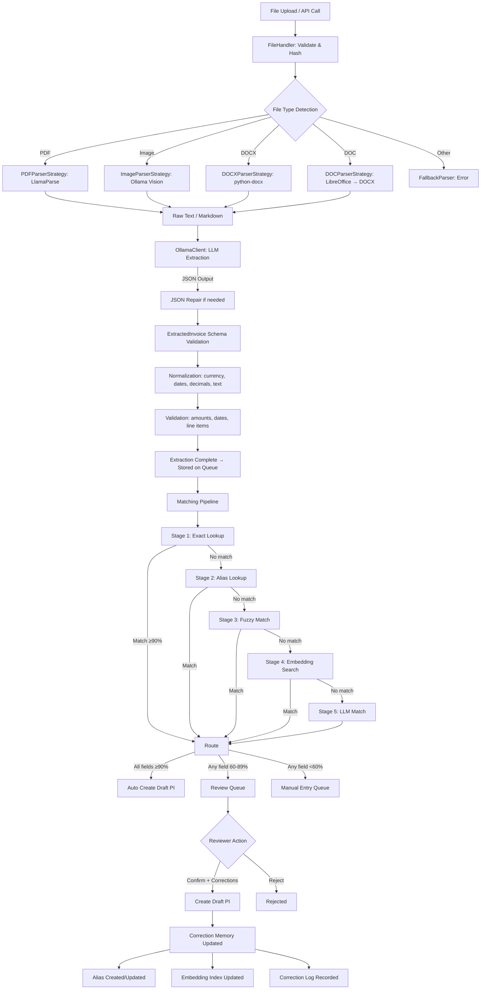
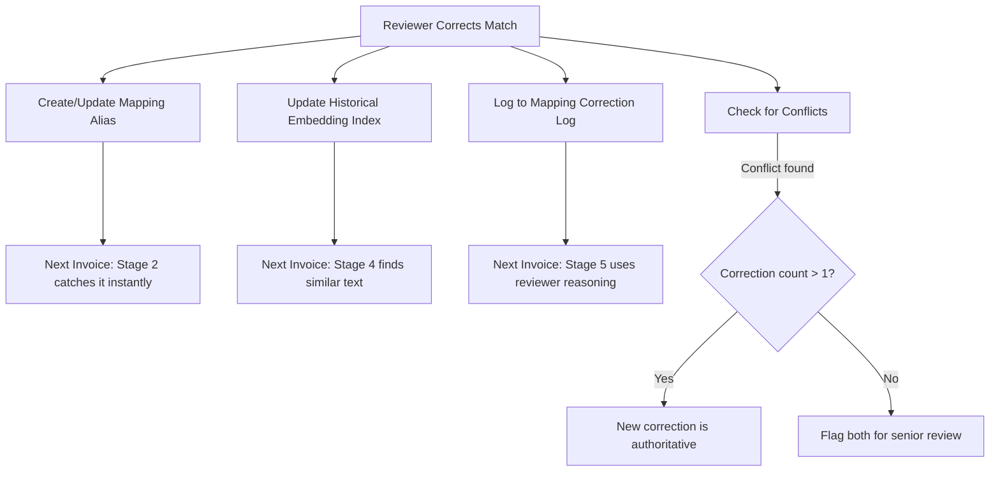
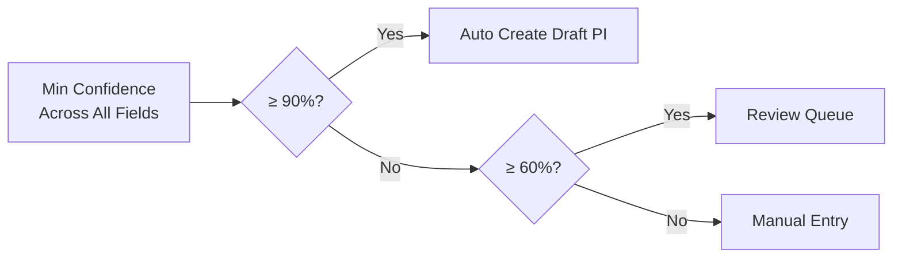

# Invoice Automation - System Flow Documentation

## End-to-End Pipeline



## Subsystem 1: Extraction Engine

### File Processing Pipeline

```
File Upload → Type Detection → Format Routing → Parsing → LLM Extraction → Schema Validation → Normalization → Validation → Output
```

**Step 1: File Handling** (`file_handler.py`)
- Validates file size against `max_file_size_mb` setting
- Validates extension against `allowed_extensions` setting
- Computes SHA-256 hash for dedup
- Detects MIME type and file category (PDF/Image/DOCX/DOC)

**Step 2: Parser Selection** (`parsers/base_parser.py` factory)
- `PDFParserStrategy` → LlamaParse API (handles native, scanned, hybrid, multi-page)
- `ImageParserStrategy` → Direct Ollama vision model
- `DOCXParserStrategy` → python-docx text extraction
- `DOCParserStrategy` → LibreOffice conversion → DOCX parser
- `FallbackParser` → Structured error for unsupported types

**Step 3: LLM Extraction** (`ollama_client.py` + `prompt_templates.py`)
- Sends parsed text to configurable Ollama model (default: `qwen2.5vl:7b`)
- Requests strict JSON output matching ExtractedInvoice schema
- Retries on malformed JSON (configurable retry count)
- Auto-repairs common JSON issues via `json_repair.py`

**Step 4: Normalization** (`normalizers/`)
- Currency: ₹ → INR, $ → USD, € → EUR
- Dates: diverse formats → ISO 8601 (YYYY-MM-DD)
- Decimals: Indian numbering (1,23,456.78), European (1.234,56)
- Text: unicode normalization, whitespace cleanup
- Tax IDs: GSTIN/PAN format validation
- Line items: dedup, empty row removal, total recalculation

**Step 5: Validation** (`validators/validation_service.py`)
- Date consistency (due_date not before invoice_date)
- Total consistency (subtotal + tax ≈ total)
- Line item math (qty × price ≈ line_total)
- Line item sum vs subtotal
- Negative amounts (credit note detection)
- Zero-value invoice warning
- Missing critical fields

## Subsystem 2: The 5-Stage Matching Pipeline

### Stage 1: Normalization + Exact Lookup (~0ms)
- GSTIN lookup → 100% confidence
- PAN (from GSTIN chars 3-12) → 98% confidence
- Normalized name → 95% confidence
- Uses Redis index for O(1) lookups

### Stage 2: Context-Aware Alias Lookup (~1ms)
- Supplier-specific: `{supplier}:{normalized_text}:{doctype}` → 99% confidence
- Supplier-agnostic: `ANY:{normalized_text}:{doctype}` → 90% confidence
- Fed by human corrections (the learning mechanism)

### Stage 3: Fuzzy String Matching (~10-50ms)
- Token Sort Ratio + Partial Ratio + Token Set Ratio (best score wins)
- Score ≥85 → 75-89% confidence
- Score 60-84 → 60-74% confidence
- Score <60 → no match

### Stage 4: Embedding-Based Semantic Search (~10-50ms)
- Historical Invoice Index (human-corrected entries weighted 1.1x)
- Item Master Index (name + description + brand + HSN)
- Both agree on same item → +10% confidence boost
- Cosine similarity > 0.85 → high confidence

### Stage 5: LLM-Assisted Match (~500-2000ms)
- Only when Stages 1-4 fail
- Claude Sonnet with candidates + past corrections with reviewer reasoning
- Confidence capped at 88% (always requires review)

## Subsystem 3: Correction Memory (CodeRabbit Pattern)



## Confidence-Based Routing



## Data Flow Between Doctypes

| Doctype | Purpose | Fed By | Feeds Into |
|---------|---------|--------|------------|
| Invoice Automation Settings | System-wide configuration | Admin | All modules |
| Invoice Processing Queue | Pipeline tracking per invoice | File upload / API | Purchase Invoice |
| Invoice Line Item Match | Per-line match results | Matching Pipeline | Review UI, PI creation |
| Mapping Alias | Learned mappings | Human corrections | Stage 2 lookups |
| Mapping Correction Log | Institutional knowledge | Human corrections | Stage 5 LLM context |
| Embedding Index | Vector storage | Index builder / corrections | Stage 4 search |

## Queue Record Lifecycle

| Field | When Set | By Whom |
|-------|----------|---------|
| source_file, file_name, file_hash, file_type | On upload | FileHandler |
| extraction_status, extraction_method, extraction_time_ms | During extraction | ExtractionService |
| extracted_data, extraction_confidence, document_type_detected | After extraction | ExtractionService |
| matched_supplier, supplier_match_confidence, supplier_match_stage | After matching | MatchingPipeline |
| matched_bill_no, matched_bill_date, matched_due_date | After matching | MatchingPipeline |
| routing_decision, overall_confidence, matching_time_ms | After routing | ConfidenceScorer |
| line_items (child table) | After matching | MatchingPipeline |
| purchase_invoice | After confirmation | confirm_mapping API |
| processed_by | After confirmation | confirm_mapping API |

## The Learning Curve

- **Week 1**: Most invoices go to Review Queue. System relies on exact lookups and fuzzy matching.
- **Month 1**: Alias table builds from corrections. Stage 2 catches 40-50% of repeat items.
- **Month 3**: Historical embedding index grows. Stage 4 handles variations. Review drops significantly.
- **Month 6+**: 90%+ automatic. Auto-create can be safely enabled.
