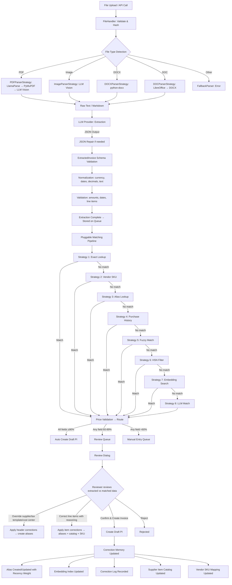
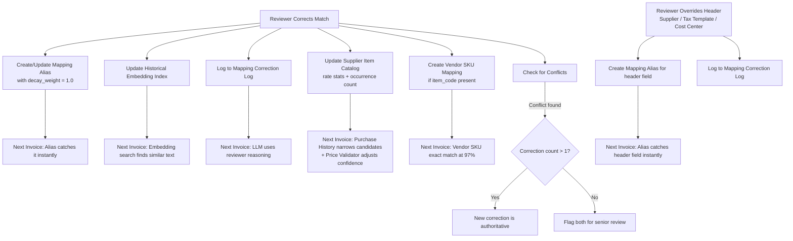
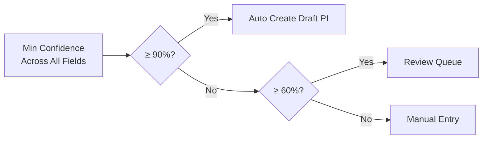

# Invoice Automation - System Flow Documentation

## End-to-End Pipeline



## Subsystem 1: Extraction Engine

### File Processing Pipeline

```
File Upload → Type Detection → Format Routing → Parsing → LLM Extraction → Schema Validation → Normalization → Validation → Output
```

**Step 1: File Handling** (`file_handler.py`)
- Validates file size against `max_file_size_mb` setting
- Validates extension against `allowed_extensions` setting
- Computes SHA-256 hash for dedup
- Detects MIME type and file category (PDF/Image/DOCX/DOC)

**Step 2: Parser Selection** (`parsers/base_parser.py` factory)
- `PDFParserStrategy` → 3-step fallback chain:
  1. LlamaParse API (if API key configured)
  2. PyMuPDF text extraction (for native PDFs with selectable text)
  3. LLM Vision (renders pages as images via PyMuPDF, sends to configured LLM — handles scanned PDFs)
- `ImageParserStrategy` → Configured LLM provider's vision model (Ollama, OpenAI, Anthropic, or Gemini)
- `DOCXParserStrategy` → python-docx text extraction
- `DOCParserStrategy` → LibreOffice conversion → DOCX parser
- `FallbackParser` → Structured error for unsupported types

**Step 3: LLM Extraction** (`llm/` providers + `prompt_templates.py`)
- Sends parsed text to the configured extraction LLM provider (Ollama, OpenAI, Anthropic, or Gemini)
- Default: Ollama with `qwen2.5vl:7b` (local, free). Paid alternatives: GPT-4o, Claude, Gemini
- Requests strict JSON output matching ExtractedInvoice schema
- Retries on malformed JSON (configurable retry count)
- OpenAI and Gemini use native JSON mode; Ollama and Anthropic use retry + `json_repair.py`

**Step 4: Normalization** (`normalizers/`)
- Currency: ₹ → INR, $ → USD, € → EUR
- Dates: diverse formats → ISO 8601 (YYYY-MM-DD)
- Decimals: Indian numbering (1,23,456.78), European (1.234,56)
- Text: unicode normalization, whitespace cleanup
- Tax IDs: GSTIN/PAN format validation
- Line items: dedup, empty row removal, total recalculation

**Step 5: Validation** (`validators/validation_service.py`)
- Date consistency (due_date not before invoice_date)
- Total consistency (subtotal + tax ≈ total)
- Line item math (qty × price ≈ line_total)
- Line item sum vs subtotal
- Negative amounts (credit note detection)
- Zero-value invoice warning
- Missing critical fields

## Subsystem 2: Pluggable Matching Pipeline

The matching pipeline loads strategies dynamically from the **Matching Strategy** doctype. Strategies are executed in priority order (lower = first). Each can be enabled/disabled and reordered without code changes. Falls back to hardcoded defaults if no strategy records exist.

### Strategy 1: Exact Lookup (Priority 10, ~0ms)
- GSTIN lookup → 100% confidence
- PAN (from GSTIN chars 3-12) → 98% confidence
- Normalized name → 95% confidence
- Uses Redis index for O(1) lookups

### Strategy 2: Vendor SKU Lookup (Priority 15, ~1ms)
- Matches vendor-specific item codes from the invoice against **Vendor SKU Mapping**
- Looks up `(supplier, extracted_item_code)` → mapped ERPNext Item
- 97% confidence — just below exact match
- Vendor SKU Mappings are auto-created from corrections when the invoice has an `item_code`

### Strategy 3: Context-Aware Alias Lookup (Priority 20, ~1ms)
- Supplier-specific: `{supplier}:{normalized_text}:{doctype}` → up to 99% confidence
- Supplier-agnostic: `ANY:{normalized_text}:{doctype}` → up to 90% confidence
- Confidence scaled by **decay_weight** (1.0 for fresh aliases, decays to 0.5 over 100+ days)
- Fed by human corrections on both line items and header fields (supplier, tax template, cost center)

### Strategy 4: Purchase History Match (Priority 25, ~10ms) — Disabled by default
- Queries **Supplier Item Catalog** for items this supplier has sold before
- Fuzzy matches against catalog items only (narrowed candidate set)
- Frequency-boosted: items bought more often score higher
- 70-85% confidence

### Strategy 5: Fuzzy String Matching (Priority 30, ~10-50ms)
- Token Sort Ratio + Partial Ratio + Token Set Ratio (best score wins)
- Score ≥85 → 75-89% confidence
- Score 60-84 → 60-74% confidence
- Score <60 → no match

### Strategy 6: HSN-Filtered Matching (Priority 35, ~10ms) — Disabled by default
- Pre-filters candidate Items by HSN/SAC code before fuzzy matching
- Falls back to HSN prefix (first 4 digits) if exact HSN has no matches
- Provides a confidence boost over regular fuzzy matching (+5-10%)

### Strategy 7: Embedding-Based Semantic Search (Priority 40, ~10-50ms)
- Uses `sentence-transformers/all-MiniLM-L6-v2` (384-dim, L2-normalized)
- In-memory NumPy index (no external vector DB) backed by `Embedding Index` DocType
- Cosine similarity via dot product — O(n) scan against all stored vectors
- Historical Invoice Index (human-corrected entries weighted 1.1x)
- Item Master Index (name + description + brand + HSN)
- Both agree on same item → +10% confidence boost
- Cosine similarity > 0.85 → high confidence

### Strategy 8: LLM-Assisted Match (Priority 50, ~500-2000ms)
- Only when all other strategies fail
- Uses the configured matching LLM provider (Ollama, OpenAI, Anthropic, or Gemini)
- Sends candidates + past corrections with reviewer reasoning
- Confidence capped at 88% (always requires review)

### Post-Match: Price Validation
After any strategy produces a match, the **price validator** adjusts confidence based on historical price data from the Supplier Item Catalog:
- Rate within 15% of average → +5% confidence boost
- Rate >50% off average → -10% confidence penalty
- Requires ≥2 historical occurrences

## Subsystem 3: Correction Memory (CodeRabbit Pattern)



## Confidence-Based Routing



## Data Flow Between Doctypes

| Doctype | Purpose | Fed By | Feeds Into |
|---------|---------|--------|------------|
| Invoice Automation Settings | Configuration + custom extraction fields | Admin | All modules |
| Invoice Processing Queue | Pipeline tracking per invoice | File upload / API | Purchase Invoice |
| Invoice Line Item Match | Per-line match results | Matching Pipeline | Review UI, PI creation |
| Mapping Alias | Learned mappings with recency decay | Human corrections (line items + headers) | Alias strategy lookup |
| Mapping Correction Log | Institutional knowledge | Human corrections | LLM strategy context |
| Embedding Index | Vector storage | Index builder / corrections | Embedding strategy search |
| Matching Strategy | Strategy registry (enable/disable/reorder) | Admin / seed data | Matching Pipeline |
| Supplier Item Catalog | Supplier-item affinity + price stats | PI submissions / corrections | Purchase History strategy, Price Validator |
| Vendor SKU Mapping | Vendor item codes → ERPNext Items | Human corrections | Vendor SKU strategy |
| Extraction Field | Custom extraction field definitions | Admin (child of Settings) | Dynamic prompt + schema |

## Queue Record Lifecycle

| Field | When Set | By Whom |
|-------|----------|---------|
| source_file, file_name, file_hash, file_type | On save (after_insert) | InvoiceProcessingQueue controller |
| extraction_status, extraction_method, extraction_time_ms | During extraction | ExtractionService |
| extracted_data, extraction_confidence, document_type_detected | After extraction | ExtractionService |
| validation_results | After extraction | ExtractionService |
| matched_supplier, supplier_match_confidence, supplier_match_stage | After matching | MatchingPipeline |
| matched_bill_no, matched_bill_date, matched_due_date | After matching | MatchingPipeline |
| matched_currency, matched_total, matched_tax_template | After matching | MatchingPipeline |
| amount_mismatch, amount_mismatch_details | After matching | amount_validator |
| routing_decision, overall_confidence, matching_time_ms | After routing | ConfidenceScorer |
| workflow_state = "Under Review" | After routing (confidence 60-89%) | MatchingPipeline |
| line_items (child table) | After matching | MatchingPipeline |
| purchase_invoice | After review confirmation | confirm_mapping API |
| processed_by | After review confirmation | confirm_mapping API |

## Review & Correction Flow

When a user clicks **Review & Create Invoice**:

1. `get_review_data` API returns extracted vs matched data side-by-side (including `source_file` for preview and enriched line item fields: item_code, SKU, tax_rate, discount)
2. A two-panel review dialog opens:
   - **Left panel**: Invoice preview (PDF iframe or image) with toggle to hide/show
   - **Right panel** (scrollable):
     - Color-coded validation warnings (amount mismatches, duplicates, extraction issues)
     - Compact header grid with confidence badges and pencil-to-edit for Supplier, Tax Template, Cost Center
     - Line item cards sorted by attention needed (low confidence first, auto-expanded)
     - Each card expands inline to show full extracted details (qty, rate, amount, UOM, HSN, item code, SKU, tax rate, discount) + correction fields
   - **Sticky summary bar**: attention count, change count, action buttons — updates in real-time
3. On confirm, `confirm_mapping` API:
   - Applies header overrides (supplier, tax template, cost center) — each creates aliases and correction logs via `process_header_correction()`
   - Processes line item corrections via `process_correction()`:
     - Creates/updates Mapping Alias with recency weight (Alias strategy learning)
     - Logs to Mapping Correction Log (LLM strategy context)
     - Enqueues embedding index update (Embedding strategy learning)
     - Updates Supplier Item Catalog (Purchase History strategy + Price Validator)
     - Creates Vendor SKU Mapping if vendor item code present (Vendor SKU strategy)
     - Checks for conflicts with prior corrections
   - Runs duplicate detection
   - Creates Draft Purchase Invoice with matched/extracted data + custom field mappings

## The Learning Curve

- **Week 1**: Most invoices go to Review Queue. System relies on exact lookups and fuzzy matching.
- **Month 1**: Alias table builds from corrections. Vendor SKU mappings established. Alias strategy catches 40-50% of repeat items.
- **Month 3**: Supplier Item Catalog populates from PI submissions. Purchase History strategy narrows candidates. Historical embedding index grows. Embedding strategy handles variations. Review drops significantly.
- **Month 6+**: 90%+ automatic. Price validation boosts confidence on well-known items. Older aliases with low decay weight get deprioritized in favor of recent corrections. Auto-create can be safely enabled.
